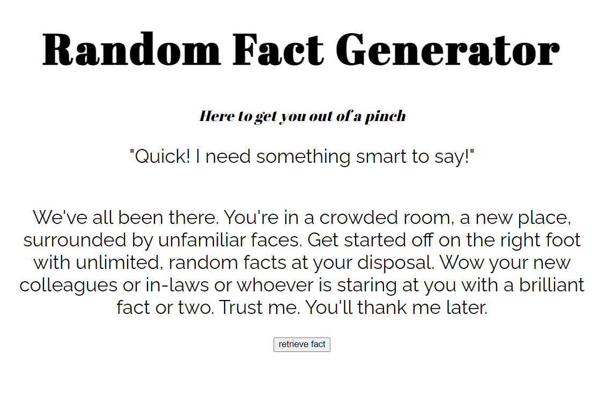

# Random Fact Generator
You never know when you might need a good conversation stater. What better way than with a random fact!

**Link to project:** [Random Fact Generator](https://savvycolleen.github.io/randomfactgenerator/)

## How It's Made:

**Tech used:** HTML, CSS, JavaScript

This was built using a web API. The button triggers a click event to fetch data from the API, and the data (in this case, a random fact) is placed in the DOM. Every click retrieves a new fact!

## Lessons Learned:

This project gave me practice testing APIs and allowed me to play with how you can retrieve and present data. 
